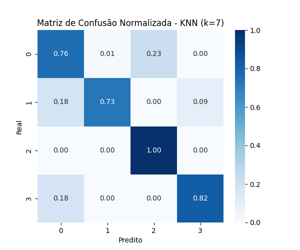
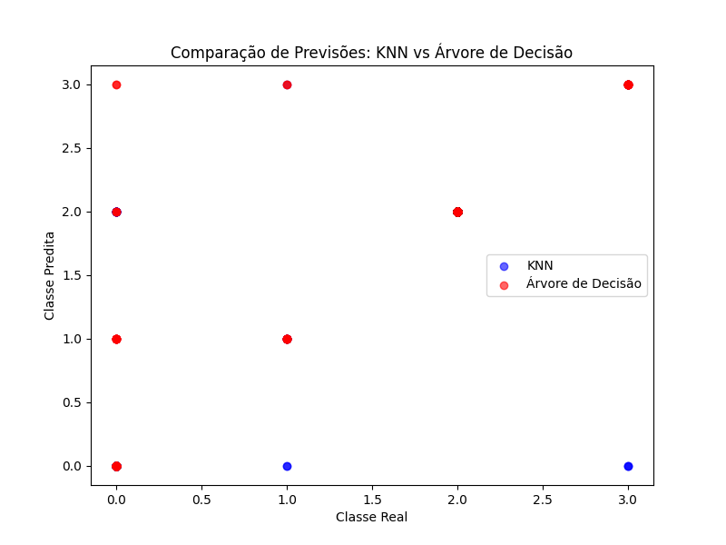

# Trabalho Final - Reconhecimento de Padrões  

**Instituto Federal do Ceará - Campus Maracanaú**  
**Disciplina:** Reconhecimento de Padrões  
**Professor:** Hericson Araújo  
**Aluno:** Francisco Aldenor Silva Neto  
**Matrícula:** 20221045050117  

## 1. Introdução

O objetivo deste trabalho é aplicar algoritmos de aprendizagem de máquina para a classificação de carros com base em um conjunto de atributos. O problema escolhido envolve a previsão da avaliação de carros, onde as instâncias devem ser classificadas em uma das cinco categorias de qualidade, baseadas em características como preço, manutenção, número de portas e outros atributos relacionados. Para este experimento, foram utilizados dois modelos de classificação: **KNN (K-Nearest Neighbors)** e **Árvore de Decisão**.

A motivação por trás da escolha desse problema está na sua aplicabilidade em sistemas de recomendação de carros, análise de preferências do consumidor e em outras áreas de comércio e serviços relacionados a veículos. Este estudo visa avaliar qual dos dois modelos apresenta o melhor desempenho em termos de precisão, recall, F1-score, e acurácia, além de analisar as características dos modelos e sua interpretação.

## 2. Fundamentação Teórica

### Descrição do Problema

O problema de **classificação** de carros, utilizado no conjunto de dados **Car Evaluation** do UCI Machine Learning Repository, visa prever a avaliação de um carro com base em seus atributos. O conjunto de dados é composto por 1728 instâncias e 7 atributos, sendo todos os atributos do tipo categórico.

### Atributos:
- **buying**: Avaliação do preço do carro (low, med, high, vhigh).
- **maint**: Avaliação do custo de manutenção (low, med, high, vhigh).
- **doors**: Número de portas do carro (2, 3, 4, 5more).
- **persons**: Número de pessoas que o carro pode acomodar (2, 4, more).
- **lug_boot**: Tamanho do porta-malas (small, med, big).
- **safety**: Avaliação da segurança do carro (low, med, high).
- **class**: Classe de avaliação do carro (unacc, acc, good, vgood).

## 3. Metodologia

### Modelos Utilizados

Foram aplicados dois modelos de classificação:
- **KNN (K-Nearest Neighbors)**: Algoritmo baseado na proximidade das instâncias para realizar a classificação. O valor de k foi ajustado para diferentes valores para observar o impacto no desempenho.
- **Árvore de Decisão**: Modelo que realiza classificações baseadas em decisões sequenciais, oferecendo uma boa interpretabilidade do processo de tomada de decisão.

### Pré-processamento dos Dados

Antes da aplicação dos modelos, o conjunto de dados foi pré-processado da seguinte maneira:
- As variáveis categóricas foram transformadas em variáveis numéricas usando a técnica de **One-Hot Encoding**.
- A divisão entre conjunto de treino e teste foi realizada utilizando uma proporção de 80% para treino e 20% para teste.

### Métricas de Avaliação

As seguintes métricas foram utilizadas para avaliar o desempenho dos modelos:
- **Precisão (Precision)**: Proporção de instâncias corretamente classificadas de uma classe específica.
- **Recall**: Capacidade do modelo de identificar corretamente todas as instâncias de uma classe.
- **F1-Score**: Média harmônica entre precisão e recall.
- **Acurácia**: Proporção total de previsões corretas em relação ao número total de instâncias.
- **Matriz de Confusão**: Avaliação detalhada de como o modelo classificou cada classe.

## 4. Experimentos

### Resultados do KNN

O modelo KNN foi avaliado com diferentes valores de k (k=3, k=5, k=7) para verificar o impacto do número de vizinhos no desempenho da classificação.

#### KNN (k=3)
- **Acurácia**: 86,42%
- **Matriz de Confusão**:
  [[ 57 5 21 0]  
  [ 5 6 0 0]  
  [ 5 1 229 0]  
  [ 6 3 1 7]]

#### KNN (k=5)
- **Acurácia**: 88,73%
- **Matriz de Confusão**:
  [[ 59 5 18 1]  
  [ 5 6 0 0]  
  [ 0 0 235 0]  
  [ 5 2 3 7]]

#### KNN (k=7)
- **Acurácia**: 92,49%
- **Matriz de Confusão**:
  [[ 63 1 19 0]  
  [ 2 8 0 1]  
  [ 0 0 235 0]  
  [ 3 0 0 14]]

### Resultados da Árvore de Decisão

O modelo de Árvore de Decisão foi treinado utilizando o conjunto de dados completo, sem ajustes de hiperparâmetros.

- **Acurácia**: 94,80%
- **Matriz de Confusão**:
  [[ 67 10 4 2]  
  [ 0 9 0 2]  
  [ 0 0 235 0]  
  [ 0 0 0 17]]

### Comparação dos Modelos

A comparação entre os modelos KNN e Árvore de Decisão revelou que a **Árvore de Decisão** obteve o melhor desempenho, com uma **acurácia de 94,80%**, seguida pelo KNN com k=7, que obteve **92,49%**.

#### Acurácias dos Modelos:
- **KNN (k=3)**: 86,42%
- **KNN (k=5)**: 88,73%
- **KNN (k=7)**: 92,49%
- **Árvore de Decisão**: 94,80%

### Gráficos Gerados

## 5. Conclusão

O experimento revelou que a **Árvore de Decisão** apresentou o melhor desempenho em termos de acurácia, superando o modelo KNN em todas as métricas avaliadas. A Árvore de Decisão também se destacou pela sua capacidade de gerar uma interpretação clara das decisões tomadas, o que a torna altamente útil em problemas onde a explicabilidade é importante.

Por outro lado, o modelo KNN, apesar de ser mais simples, mostrou um bom desempenho com k=7, evidenciando que ajustes de hiperparâmetros podem melhorar significativamente sua performance.
## Repositório

- **Github**: [KNN and Decision_Tree](https://github.com/Aldenor-Neto/Reconhecimento_de_padroes-TrabalhoFinal-KNN_and_decisionTree)
